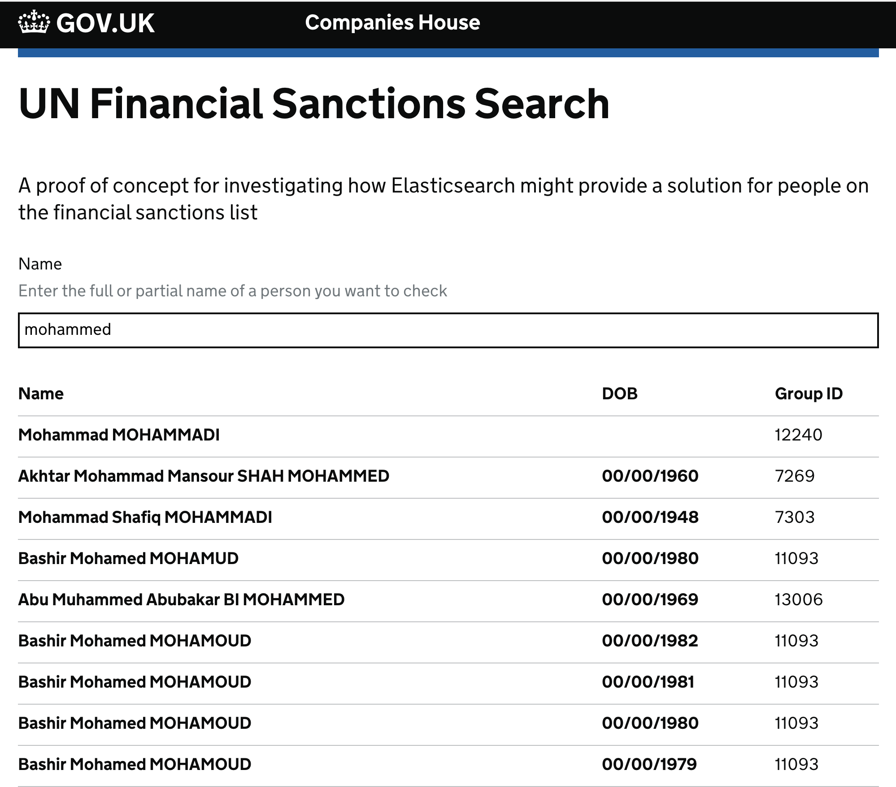

Financial Sanctions Search
===

This is a proof of concept of building a search engine to identify people on the [financial sanctions list](https://www.gov.uk/government/publications/financial-sanctions-consolidated-list-of-targets/consolidated-list-of-targets). It uses Elasticsearch as the engine, configured to use synonyms for people's names.

## Running this locally

#### Install dependencies

    npm i
    
#### Start Elasticsearch

If you don't have an instance of Elasticsearch running, there is a [docker compose](https://docs.docker.com/compose/) configuration that you can start up.

    docker-compose up -d
    
By default, the application is expecting it to be running on `localhost:9200`. If you have it running elsewhere, set the environment variable `ES_HOST`.

#### Download and index the latest sanctions list

Execute the following `npm` script to download the latest list and index into Elastic.

    npm run setup

#### Start the express server

In a terminal execute the following...

    npm start
    
#### Start the webpack dev server

In another terminal, execute the folling...

    npm run static:dev

#### Search for a name

Open [http://localhost:3000](http://localhost:3000/) in your browser and search for a name. For a list of synonyms, see the [es-config.json](./bin/es-config.json) file.

